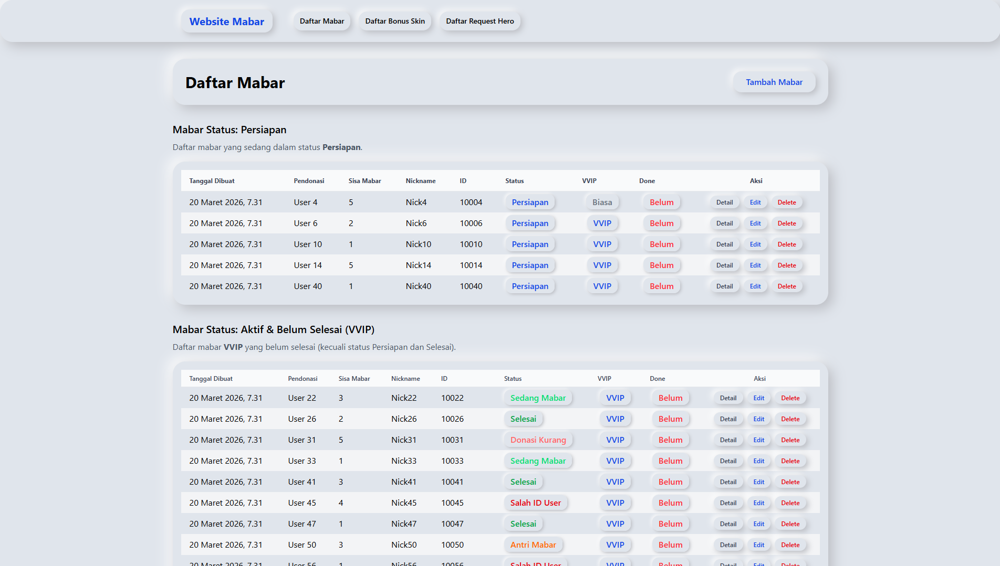

# Management Mabar VIP MLBB



A Django web application for managing and tracking VIP Mabar (play together) sessions, bonus skin requests, and hero requests for Mobile Legends: Bang Bang (MLBB) streamers and their communities.

## Features

- **Mabar Management:** Track, update, and manage Mabar sessions with status, notes, and VVIP flags.
- **Bonus Skin Requests:** Record and process bonus skin requests linked to Mabar sessions.
- **Hero Requests:** Allow users to request specific heroes and lanes, with status tracking.
- **Admin Dashboard:** Full CRUD for all models, with advanced filtering and export (CSV/XLSX) in Django admin.
- **Modern Public Interface:** Responsive UI using Tailwind CSS and neumorphism design, with status badges and toggle switches.
- **Authentication:** Admin-only CRUD, public read-only access to lists and details.
- **Deployment Ready:** Configured for Vercel serverless deployment.

## Project Structure

- `mabar/` — Django app with models, forms, views, templates, and admin customization
- `website_mabar/` — Django project configuration
- `static/` — Custom static files (CSS, JS, images)
- `templates/public/` — Tailwind + neumorphism templates for public and admin views
- `vercel.json` — Vercel deployment configuration

## Getting Started

### Prerequisites

- Python 3.10+
- pip

### Installation

1. Clone the repository:

   ```bash
   git clone https://github.com/ridwaanhall/management-mabar-VIP-MLBB.git
   cd management-mabar-VIP-MLBB
   ```

2. Install dependencies:

   ```bash
   pip install -r requirements.txt
   ```

3. Run the development server:

   ```bash
   python manage.py runserver
   ```

4. Login with

   ```txt
   username: admin
   password: admin
   ```

### Usage

- **Admin Panel:**
  - Access: `http://127.0.0.1:8000/admin/`
  - Manage Mabar, Bonus Skin, and Request Hero records.

- **Public Pages:**
  - Mabar List: `http://127.0.0.1:8000/public/list-mabar/`
  - Bonus Skin List: `http://127.0.0.1:8000/public/list-free-skin/`
  - Request Hero List: `http://127.0.0.1:8000/public/list-req-hero/`

## Deployment

This project is ready for deployment on Vercel (serverless):

- See `vercel.json` for configuration.
- Static files are served using Whitenoise.
- Set environment variables (e.g., `DEBUG`, `SECRET_KEY`) as needed.

## Technologies Used

- Django 6.x
- Tailwind CSS (CDN)
- Neumorphism custom CSS
- Whitenoise (static files)
- openpyxl (admin export)

## License

This project is licensed under the MIT License. See the [LICENSE](LICENSE) file for details.
